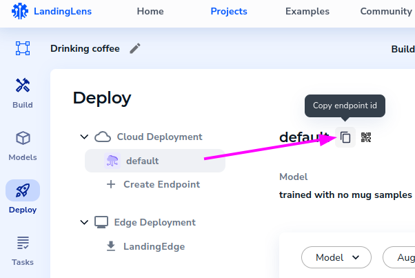
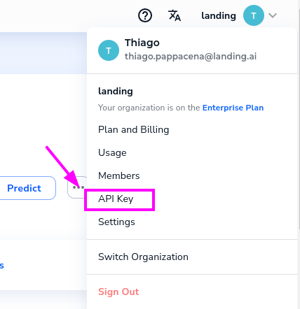

<p align="center">
  
</p>

# Welcome to Landing.ai SDK documentation

Landing.ai SDK is a set of tools to help you build computer vision applications, including
integration with [LandingLens](https://app.landing.ai/).

The SDK includes helper features to acquire, process and detect things in your images and videos, with the minimum lines of code possible.

## Quick start


### Instalation
First, install the SDK:

```bash
pip install landingai
```

### Acquiring your first images
After installing, you can start acquiring images from one of our image sources.

For example, from a single image file:

```py
from landingai.pipeline.frameset import FrameSet

frame = FrameSet.from_image("/path/to/your/image.jpg") # (1)!
frame.resize(width=512, height=512) # (2)!
frame.save_image("/tmp/resized-image.png") # (3)!
```

1. We support a large variety of image files formats. Just give it a try.
2. Resize the image to 512x512 pixels.
3. Save the resized image to `/tmp/resized-image.png`.


You can also extract frames from your webcam, for example:

```py
from landingai.pipeline.image_source import Webcam

with Webcam(fps=0.5) as webcam:  # (1)!
    for frame in webcam:
        frame.resize(width=512, height=512) # (2)!
        frame.save_image("/tmp/webcam-image.png") # (3)!
```

1. Capture images from the webcam at 0.5 frames per second (1 frame every 2 seconds), closing the camera at the end of the `with` block
2. Resize the frame to 512x512 pixels
3. Save the images as `/tmp/webcam-image-<timestamp>.png`


For more image sources, check the [Image aquisition section](image-acquisition/image-acquisition.md).


### Running inferences
Now, if you already have a LandingLens account and a trained model, you
can start detecting things in your images.

Let's use the images from our webcam and our coffee mug detector model, already deployed in LandingLens:

???+ note

    If you still don't have a LandingLens account, create an account [here](https://app.landing.ai/)
    and [watch Andrew Ng show you how to build your first model](https://www.youtube.com/watch?v=779kvo2dxb4). Or visit the [Support Center](https://support.landing.ai/docs/landinglens-workflow) for a walkthrough on how to deploy your first model, and how to get [your API key](https://support.landing.ai/docs/api-key).

```py
from landingai.pipeline.image_source import Webcam
from landingai.predict import Predictor

predictor = Predictor(  # (1)!
    endpoint_id="abcdef01-abcd-abcd-abcd-01234567890", # (2)!
    api_key="land_sk_xxxxxx", # (3)!
)
with Webcam(fps=0.5) as webcam:
    for frame in webcam:
        frame.resize(width=512) # (4)!
        frame.run_predict(predictor=predictor) # (5)!
        if "coffee-mug" in frame.predictions:  # (6)!
            frame.save_image("/tmp/latest-webcam-image.png", image_src="overlay") # (7)!
```

1. Creates a LandingLens predictor object
2. Here, you should set the endpoint_id you've got from the platform: <br/>.
3. Here, you should set the API key you've got from the platform: <br/> .
4. Resize the image to `width=512`, keeping the aspect ratio. This is useful to save some bandwidth when sending the image to LandingLens for prediction.
5. Runs inference in the resized frame, and returns a new frame with the predictions
6. If a class names `coffee-mug` is found in the prediction
7. Save the image with the predictions overlayed on top of the image (the `image_src="overlay"` part)

That's it. Now, with just a few lines of code, you detect coffee mugs passing by your webcam.

You can now check the other image sources available, and other helpers to process your images and the predictions you do on them. Check also our [Examples section](examples.md) for inspiration.