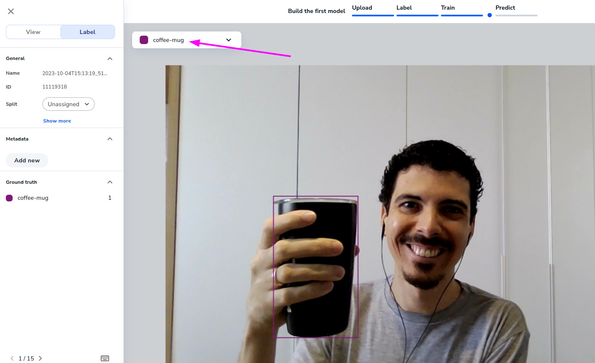

Now that you have the API key and an endpoint ID (if you don't, see [Running inferences / Getting started](inferences/getting-started.md) section), you can run your first inference using the SDK.

## Working with frames

The SDK provides a variety of image sources helpers that can be used to acquire images (see [Image acquisition](image-acquisition/image-acquisition.md) section), and all those image sources yields `Frame` objects, that can be used to run inferences.

The process is pretty straightforward. To run inferences in frames extracted from the webcam, for example, you will just use the `Webcam` and the `Predictor` classes:

```py
from landingai.pipeline.image_source import Webcam
from landingai.predict import Predictor

predictor = Predictor(
    endpoint_id="<insert your endpoint ID here>",
    api_key="<insert your API key here>",
)
with Webcam(fps=0.5) as webcam:
    for frame in webcam:
        frame.resize(width=512)
        frame.run_predict(predictor=predictor)
        if "coffee-mug" in frame.predictions:
            print(frame.predictions)
```

The code above will run inferences on frames extracted from the webcam, and print the predictions if a "coffee-mug" is detected in the frame. "coffee-mug", in this case, is one of the classes labeled in LandingLens.



## Filtering predictions

You can also filter the predictions by label, for example, to count only the predictions for "coffee-mug":

```py
with Webcam(fps=0.5) as webcam:
    for frame in webcam:
        frame.run_predict(predictor=predictor)
        total_coffee_mugs = len(frame.predictions.filter_label("coffee-mug"))
        if len(total_coffee_mugs):
            print(
                f"Found more than one coffee-mug in the frame!
                Found {total_coffee_mugs}!"
            )
```

Another way to filter the prediction result is by "confidence score". The confidence score is a value between 0 and 1 that represents how confident the model is about the prediction. For example, if the model is 100% sure that there is a coffee-mug in the frame, the confidence score will be 1. If the model is 50% sure, the confidence score will be 0.5.

LandingLens by default deploys the best confidence score for you, to balance false-positives and false-negatives. But it is possible to
filter the predictions by confidence score, for example, to count only the predictions with confidence score greater than 0.95:

```py
with Webcam(fps=0.5) as webcam:
    for frame in webcam:
        frame.run_predict(predictor=predictor)
        if "coffee-mug" in frame.predictions.filter_threshold(0.95):
            print(f"I'm super sure I found a coffee-mug in the frame!")
```

## Predictor rate limit

The `Predictor` object is the main object used to run inferences. It calls LandingLens API to execute inferences using the hosted model.

Keep in mind that LandingLens has rating limit that varies with your plan. At the moment, non-enterprise plans allows for up to 40 requests per minute. If you exceed this limit, your Predictor object will retry the request automatically after some seconds.

Please, adjust your image capturing rate to avoid exceeding the limit, or contact LandingAI team ([sales@landing.ai](sales@landing.ai)) to upgrade your plan for higher limits or local inferences support.