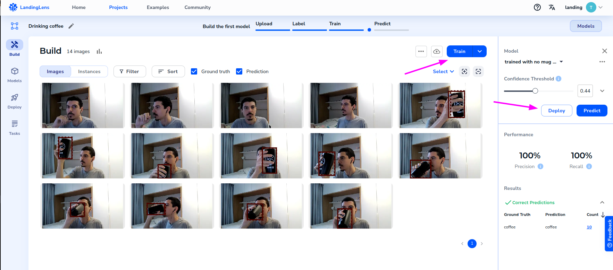
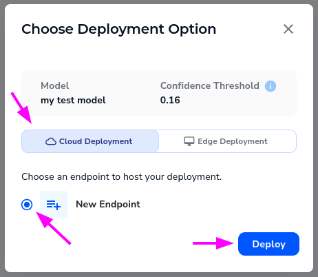
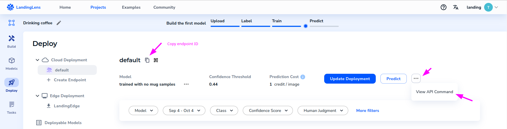
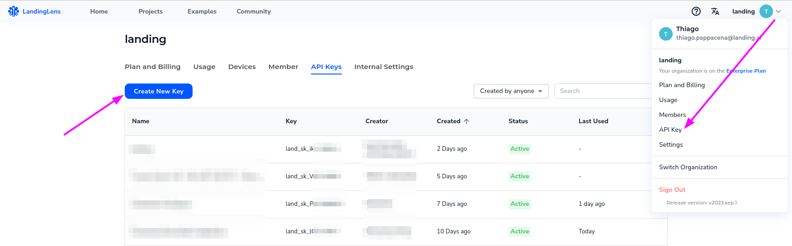

Once you are ready to [acquire images](image-acquisition/image-acquisition.md), it's now time to perform inferences on them. This section will cover the basics of how to perform inferences on images to classify, detect objects or create segmentation masks on the acquired frames.

## Building your first model

To run inferences using LandingLens, you must first build a model. If you didn't sign up before, visit https://app.landing.ai/, sign up for a free account and create a new project. If you are not familiar with LandingLens, you can find a lot of useful information in the [LandingLens support center](https://support.landing.ai/docs/landinglens-workflow).

Long story short, after creating a project in LandingLens you will need to:

1. Upload some images with the thing you want to detect
2. Label those images
3. Train a model by clicking the "Train" button
4. Once the model is trained, you will need to click the "Deploy" button to deploy the model to an endpoint provided by LandingLens

The image below ilustrate LandingLens panel with some example images already labeled, and the "Train" and "Deploy" buttons.

## Getting the endpoint ID

Once you click "Deploy", the easier way to deploy the model is to select "Cloud deployment" as the deployment type, and create a new endpoint. This will provide you with an endpoint that you can use to perform inferences on frames using your model.

In the "Deploy" page, you can see more details about this new endpoint, including an example on how to run prediction with the SDK, and a button to copy the endpoint ID.

Keep this endpoint ID. You will need it to run inferences using the SDK.

## Getting the API Key

Apart from the endpoint ID, you will need an API Key to connect the SDK to LandingLens backend. To get the API Key, click on your user name in the top right corner of the LandingLens console, and select "API Key". Then, create a new API key by clicking the "Create New Key" button.

## What's next?

Now that you have both the API key and the endpoint ID, go to [Running inferences / Working with frames](frames-inference.md) section to run your first inference using the SDK.